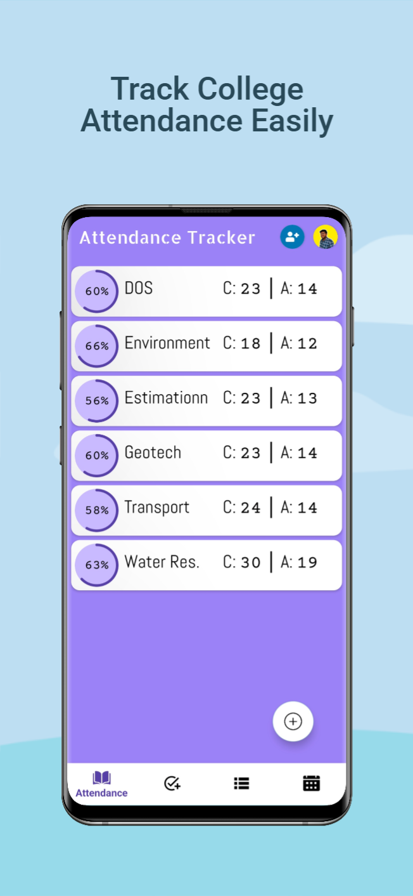
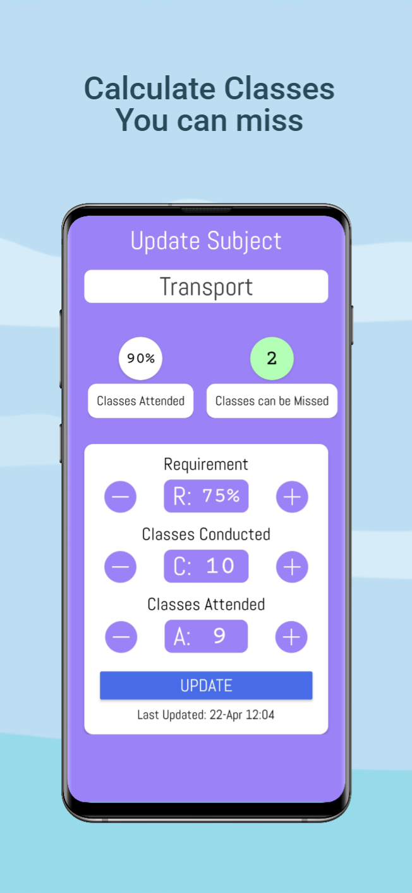
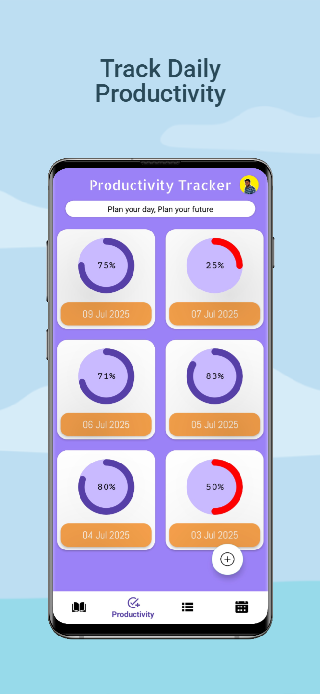
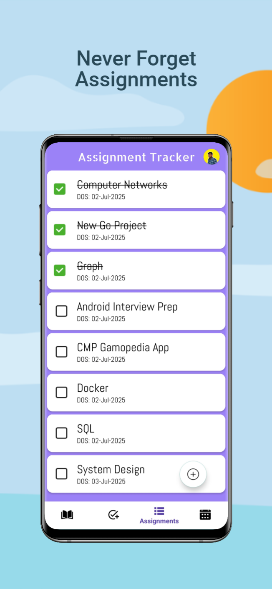
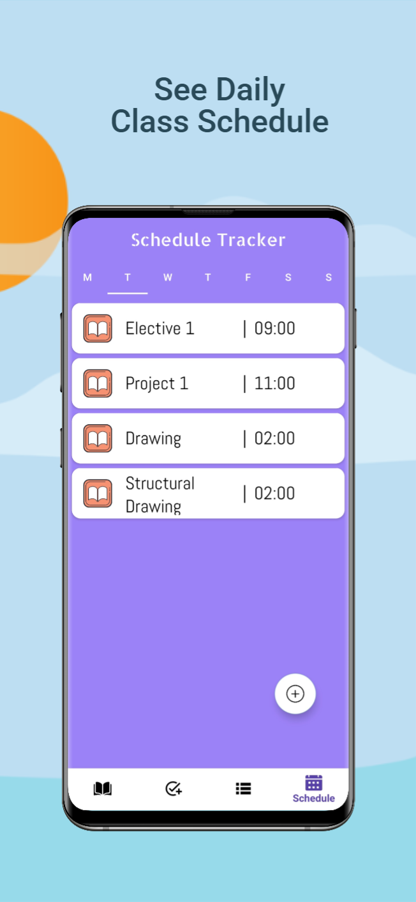

# 🎓 College Tracker – Attendance & Productivity 📚📈

**College Tracker** is your all-in-one student productivity app, built to help you stay on top of your academic life. With powerful attendance tracking, assignment management, daily schedules, and productivity insights, College Tracker ensures you're never caught off guard.

🚀 **Already trusted by 5000+ students on the Play Store!**  
📲 **App Link**: [College Tracker on Play Store](https://play.google.com/store/apps/details?id=com.collegetracker)

---

## ✨ Features

- 📅 **Attendance Tracker** – Monitor attendance for all subjects with real-time insights into how many classes you can miss or need to attend to meet your target.
- ✅ **Productivity Tracker** – Stay motivated with daily productivity stats to build better academic habits.
- 📌 **Assignment Tracker** – Add all your assignments and submission dates in one place to ensure you never miss a deadline.
- 🗓️ **Schedule Tracker** – Organize and view your daily class schedule in a clean, structured layout.
- ☁️ **Dual Storage** – Your data is stored both online (Firebase Firestore) and offline (Room database) for seamless access—anytime, anywhere.
- 🔔 **Smart Notifications** – Stay updated with reminders for assignments, classes, and more.

---

## 🛠️ Tech Stack

- **Language:** Kotlin  
- **UI:** XML  
- **Architecture:** MVVM  
- **Backend:** Firebase (Firestore, Authentication)  
- **Offline Storage:** Room Database  
- **Authentication:** Google OAuth  
- **Other Tools:** Local Notifications, SharedPreferences, RecyclerView, Material Design Components

---

## 📸 Screenshots

| Attendance Tracker |  Target Calculator  | Productivity Tracker | Assignment Tracker |  Schedule Tracker  |
|--------------------|---------------------|----------------------|--------------------|--------------------|
|  |  |  |  |  |

---

## 📥 Installation

1. Download the app from [Google Play Store](https://play.google.com/store/apps/details?id=com.yourapp.package.name).  
2. Sign in with your Email or Google account.  
3. Start tracking attendance, productivity, assignments, and more!  
4. Enjoy dual storage and seamless performance even without internet.

---

## 🎯 Ideal For

- 📖 College Students managing multiple subjects and deadlines  
- 📅 Students preparing for competitive exams with strict schedules  
- 🧑‍🏫 Students in coaching classes needing consistent productivity tracking  
- 👥 Group project members needing to sync tasks and timelines

---

## 👨‍💻 Developer

**Suraj Verma**  
Android Developer | Kotlin Enthusiast  
[Email](mailto:thesurajsite@gmail.com)  
[LinkedIn](https://linkedin.com/in/thesurajsite)  
[Twitter/X](https://x.com/AndroidDevSuraj)
